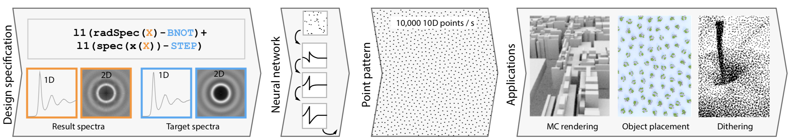

# Deep Point Correlation Design

Authors: <a href="https://www-sop.inria.fr/members/Thomas-Sebastian.Leimkuhler/" target="_blank">Thomas Leimkühler</a>, <a href="https://sampling.mpi-inf.mpg.de/">Gurprit Singh</a>, <a href="http://people.mpi-inf.mpg.de/~karol/">Karol Myszkowski</a>, <a href="http://people.mpi-inf.mpg.de/~hpseidel/">Hans-Peter Seidel</a>,  <a href="http://www.homepages.ucl.ac.uk/~ucactri/">Tobias Ritschel</a>.



The paper and supplemental material can be found on our <a href="https://sampling.mpi-inf.mpg.de/deepsampling.html">project webpage</a>.

	@article{leimkuehler2019sigasia,
          title={Deep Point Correlation Design},
          author={Thomas Leimk\"uhler and Gurprit Singh and Karol Myszkowski and Hans-Peter Seidel and Tobias Ritschel},
          journal={ACM Transactions on Graphics (Proceedings of SIGGRAPH Asia 2019)},
          volume={38},
          number={6}
          year={2019},
          doi={10.1145/3355089.3356562}
        }


## Installation
To check out the code on a local machine run
```
git clone https://github.com/sinbag/deepsampling.git
```

### Prerequisite packages
This code was developed using Tensorflow v1.9 with Python v3.6 and relies on the following packages:
```
matplotlib, imageio, openEXR
```
### Compiling C++/CUDA custom ops
To compile the custom tensorflow filtering op, you can use cmake by adapting the paths `INCLUDE_DIRECTORIES()` and `SET(tensorflowLib "")` in
```
/ops/cmake/CMakeLists.txt
```
Execute the following commands on the terminal to compile and build the cmake file:
```
cd deepsampling/ops/
cmake/createBuild.sh
cmake --build ./build
```
After compilation, adapt ```CUSTOM_OP_PATH``` in
```
/ops/src/filter/dist_filter_gpu.py
```
to point to the ```libCustomOp.so``` file you created.

## Running your first experiment
We are ready to run our first experiment. You can start with the example files provided in the `src/experiments/`folder. Go to the folder containing the `main.py` file and execute the following command to start training for `Fig.8a` from the <a href="https://sampling.mpi-inf.mpg.de/publications/2019-leimkuhler-deepsampling/2019-leimkuhler-deepsampling.pdf" target="_blank">paper</a>.

```
python main.py -e experiment_fig8a
```
Note that the `.py` extension of the experiment file is not provided. To run any other experiment file, simply run
```
python main.py -e <your_experiment_filename>
```
where <your_experiment_filename> refers to the name of the file you can create following the instructions below.


## Setting up new experiments

To define a network and a design specification, you need to set up a Python experiment file and put it into
```
src/experiments/
```
You will find pre-defined experiment files in this directory, so you can just start from these. The pre-defined experiments correspond to figures in the paper and are meant for easy reproduction of results.

### 1. Global variables

First, you need to define three global variables: ```LOGS_DIR``` is the output directory, where network outputs (spectra, realizations, ...) and trained weights are written to. ```TARGET_DIR``` points to the directory where target spectra and realizations are stored. ```FILE_EXT``` is the preferred visualization output format (usually ```".pdf"``` or ```".png"```).

### 2. Environment

Next, you need to implement the ```buildEnvironment()``` function.

#### Training setup

Specify a ```TrainingSetup``` with the following parameters:

| Variable | Meaning | Symbol in paper |
| --- | --- | :---: |
| ```pointCount``` | Number of points. | m |
| ```dimCount``` | Number of dimensions. | n |
| ```batchSize``` | Number of point sets in a batch. Used for variance reduction. | - |
| ```griddingDims``` | Number of gridded dimensions. Set this to ```0``` if you don't want to use gridding. | - |
| ```convCount``` | Length of the filter sequence. | l |
| ```kernelCount``` | Number of unique filter kernels used. These kernels are distributed over the filters by linear interpolation of weights. | l_u |
| ```kernelSampleCount``` | Resolution of the filter kernels. | b |
| ```receptiveField``` | Receptive field of the filter kernels. | r |
| ```projectionsStrings``` | Here you specify which (sub-)spaces you want the filters to operate in by using a list of strings. Digits correspond to dimensions. <b>Example 1 (full space)</b>: You have set ```dimCount = 2```. Then ```['01']``` lets the filters operate in full two-dimensional space. <b>Example 2 (projective subspaces)</b>: You have set ```dimCount = 3```. Then ```['012','01','12','02']``` lets the filters operate in full three-dimensional space and in all canonical 2D subspaces. | M |
| ```customOp``` | Set to ```true``` if you want to use the custom filter implementation (recommended). | - |
| ```trainIterations``` | Training iterations. | - |
| ```learningRate``` | Learning rate. | - |
| ```displayGrid``` | Set to ```true``` if you want to display a grid on top of point visualizations. | - |
| ```evalRealizations``` | Number of point set realizations to estimate expected power spectra or differential histograms outside of the training loop. This number also specifies the number of realizations to export if ```saveEvalRealizations``` is set to ```true```. | - |
| ```saveEvalRealizations``` | Set to ```true``` if you want to export network output point sets (the number is determined by ```evalRealizations```). | - |
| ```storeNetwork``` | Set to ```true``` if you want to store trained network weights. This happens at the end of training and in regular intervals, as specified in ```backupInterval```. | - |
| ```backupInterval``` | The frequency (in training iterations) at which the network weights will be stored during training. | - |
| ```weightDir``` | The directory to load network weights from. If you want to train from scratch, set this to ```None```. | - |


If you want to use the code in <b>deployment mode</b>, set ```trainIterations = 0``` and load your network weights by specifying ```weightDir```.


#### Targets

Now you need to specify any targets that you want to use. You can define any number of spectra and differential histograms by concatenating them into lists. Keep two lists: One for spectra, one for histograms.

##### Spectra

To set up a spectrum target, create a ```FourierSetup``` with the following parameters:

| Variable  | Meaning  | Symbol in paper  |   
| --- | --- | :---: |
| ```resolution```  | Resolution of the spectrum along one axis.  | n_c |
| ```cancelDC```  | Set to ```true``` if you want to ignore the DC term (recommended).  | - |
| ```mcSamplesPerShell```  | Number of samples per radial frequency when using a Monte Carlo estimation of a radial spectrum.  | - |  

Now you can load or estimate any spectrum using the methods provided in the ```FourierSetup``` class in ```src/setup.py```, e.g., load a 2D spectrum from an EXR file using ```loadTarget2D()```.

##### Differential Histogram

To set up a histogram target, create a ```HistogramSetup``` with the following parameters:

| Variable  | Meaning  | Symbol in paper  |   
| --- | --- | :---: |
| ```trainingSetup```  | The training setup you created ealier.  | - |
| ```binCount```  | Resolution of the histogram.   | n_c |
| ```stdDev```  | The standard deviation of the Gaussian weights. | - |
| ```scale```  | Scaling of distances to focus on the relevant range. | - |
| ```mcSamples```  | Number of point set realizations used to estimate the histogram during setup. | - |  

Now you can estimate any differential histogram using the methods provided in the ```HistogramSetup``` class in ```src/setup.py```, e.g., estimate a histogram from realizations using ```createTargetFromData()```.

#### Return environment

Once you have created a training setup and a list of Fourier and/or differential histogram setups, wrap them into an environment and return it:
```
return setup.Environment(trainingSetup, fourierSetupList, histogramSetupList)
```
If you don't use a histogram or a Fourier setup, just put ```None```.

### 3. Loss

Lastly, you need to specify the loss function by implementing ```lossSetup(env, outputNode)```.  Through the environment ```env``` you have access to all information and targets you created earlier. The ```outputNode``` simply is the output of the last filtering operation of the network, i.e., the resulting point set(s).

You need to return the loss value and, optionally, (lists of) spectra and histograms you want to visualize. A simple example of a loss implementation which L1-compares the Monte Carlo estimate of the radially averaged spectrum of the network's output to a reference looks like this:

```
spectrumNode = fourier.radialSpectrumMC(outputNode, env.fourierSetupList[0])
lossNode = l1Loss(spectrumNode, env.fourierSetupList[0].target)
histogramNode =  None  
return lossNode, spectrumNode, histogramNode
```
